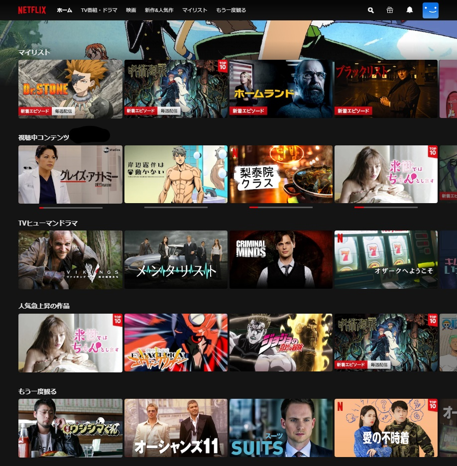
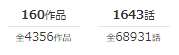
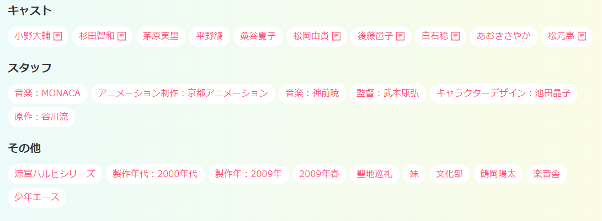
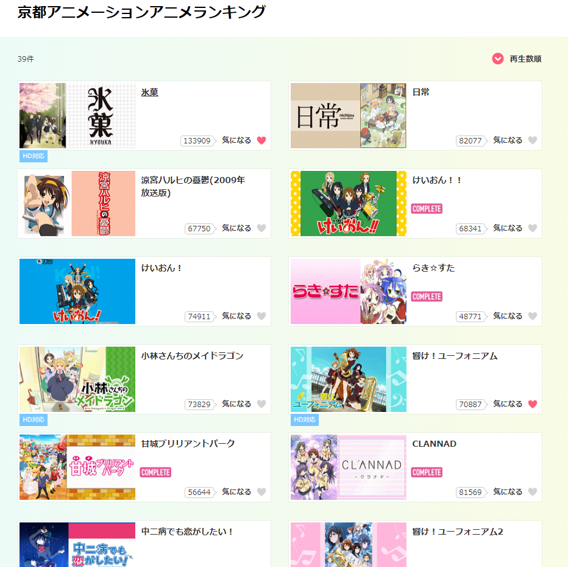

## はじめに
> [dアニメストア](https://anime.dmkt-sp.jp/animestore/tp_pc)(**以下dア**)は、ドコモが提供する**アニメ専門の配信サービス**です。ことアニメに関しては、他配信サービスの Netfix や Amazon Prime Video より圧倒的に種類が豊富なことが特徴です。

コロナの影響で家に引きこもってたので前々から気になってたらdアニメストアに加入、そのままアニメ見まくってたら1年経ってました...

||
|:-|

そんなこんなで、せっかくなので感想でもと思いカタカタ書いています

# 本題
**いや～～～～～～、最高です**

ぐうの音も出ないくらいあれです。"**良い**"です

|dアニメストア|Netflix|
|---|---|
|||

dアに加入するまでアニメを見るのに使っていた Netflix と比較すると、見た目から漂うダサさがあるんですけども、
<u>アニメ(だけ)を見る</u>という観点で比べるとdアニメストア以上は正直ないと思います

## 圧倒的な作品数
これが全てです。Netflixのアニメのレパートリーは
- 直近2,3年に放映された内人気だったもの
- 京アニ作品(**ただし、けいおんは無い(????)**)
- 海外受けするような国民的アニメ(ワンピースなど)

って感じで非常に狭いです。

対して<u>dさん</u>は
- 作品数4000超え、大抵の作品は調べて出てくる
- というか多すぎて、一種のアニメ検索エンジンと化している
- それでも無い作品は、[リクエスト](https://anime.dmkt-sp.jp/animestore/req)すると3,4ヶ月後くらいにだいたい追加されている

なんというか、前述の見た目がどうこうでケチを付けてたらねじ伏せられる感じでいいですよね、圧倒的物量で。

## 沼に沈める工夫
dアにはアニヲタくんの心をわしづかみにする工夫がちょくちょくあります
- 視聴作品数、話数のカウント
- 視聴済み作品に"COMPLETE"バッヂがつく
- スタッフなどのタグ検索

### 視聴作品数、話数のカウント
ありそうであまり無い、自分が今まで見た作品数/話数がいくつかを数えるだけのめちゃ単純な表示です。

こんなかんじ↓
||
|:-|

数字として可視化されると意外と嬉しいものです。

単純なお前らは、こんな単純な機能でも**結構グッとくる**と思います。**僕はきました**

### 視聴済み作品に"COMPLETE"バッヂがつく
見切ったらバッヂがつく、それだけ。

それだけなのに...

### スタッフなどのタグ検索
割と個人的に嬉しい機能のひとつ、
アニメスタッフ(制作会社、監督、原作、キャラデザなど)やキャストなどで検索することができます。

この機能自体はは他サービスでもありがちな機能[^1]ですが、前述の通り圧倒的アニメ作品数より**その検索ヒット数が桁違い**です

こんな感じでアニメごとに細かにタグがついています[^2]

試しに"京都アニメーション"で検索すると以下のようになります

以上のような、dアには各所各所に人を沼に沈める構造を仕込んでいます。**まだ登録してない方ははやく逃げてください**。

もう登録した方は終わりです、残念

## おわり
dアニメストアの感想記事を書こうとしたら、ただのダイマ記事になりました。

dアはいいぞ

[^1]: 他サービスはキャストのみの検索が多くでスタッフの検索があまりできません。こっちは声優なんかどうでもいいから監督が知りたいんじゃ
[^2]: これは「涼宮ハルヒの憂鬱」の例