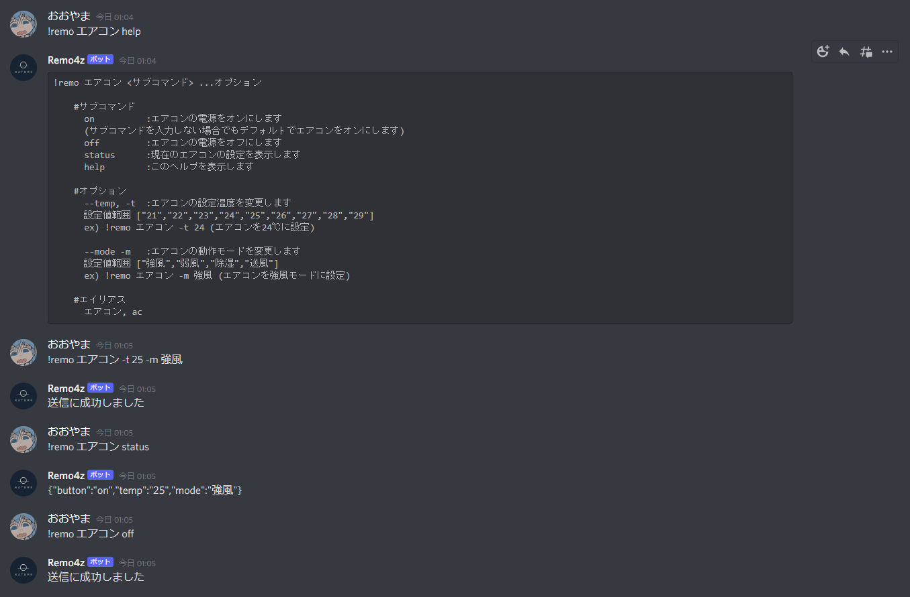

# はじめに
ひょんなことからNature Remoを教員から貸してもらえることになったので、いろいろ遊んでみようと思ってます。これはその第一弾です

# Nature Remoとは


[公式ページ](https://nature.global/nature-remo/nature-remo-mini/?gclid=CjwKCAjw0qOIBhBhEiwAyvVcf8_lD_HLPnKm084euZgWN64igeweR8JkJBG1UzK6-QaSFWQS5c_CVBoCZZUQAvD_BwE)


Nature社が出している**スマートリモコン**で、テレビやエアコンなどの赤外線で操作できる家電に対してその名の通りリモコンの役目をしてくれます。
Nature Remo自体の操作は、上の画像にも写っている公式のスマホアプリを基本的に使用します。

Nature Remo自体を家に置いておけばスマホで操作できるため、**「エアコンつけっぱで家を出てしまった...人生やり直そう...」** とか **「リモコンを無くした...俺はなんてクズ人間なんだ...」** とか今まで絶望ばかりしてきた僕の人生が、<u>Nature Remoによって負け知らずになった</u>のでかなり重宝してます

# 本題
Nature RemoをPCで操作するアプリケーションは現在のところ公式から提供されていません。

しかし、**Nature API** なるAPIが提供されているためこれを使用してNature Remoを自由に操作することができます。

今回は普段PCで常時開いているDiscordのBotを使用して、Discordから自室のエアコンをNature APIで操作してみました。

## 作ったもの
もったいぶっててもアレなので出来上がったものを先に見せます



GitHub↓

<iframe class="hatenablogcard" style="width:100%;height:155px;max-width:680px;" title="ohyama4z/remo-discord-bot: discordから自室のNature Remoを動かすbot" src="https://hatenablog-parts.com/embed?url=https://github.com/ohyama4z/remo-discord-bot" width="300" height="150" frameborder="0" scrolling="no"></iframe>

CLI風の入力でエアコンの電源のオンオフ、温度設定、動作モードの設定、現在の設定状態の取得をできるようにしています。

## Nature APIによるエアコンの操作

### Tokenの取得
[Nature API](https://swagger.nature.global)では認証のためにNature RemoのTokenが必要です。 [https://home.nature.global](https://home.nature.global)よりTokenを取得してきます。

### appliance idの取得
エアコンの操作にはエアコンの`appliance id`を使用するためcurlコマンドで確認します(JSONが見やすいようにjqに食わせています)

```bash
$ curl -X GET "https://api.nature.global/1/appliances" -H "Authorization: Bearer {取得したToken} | . jq"
```

実行結果がこんな感じ(一部省略)

```bash
[
  { ~ },
  {
    "id": "b0812da1-ea09-4c8b-8d61-6784b1f395f7",
    "device": {
      ~
    },
    "model": {
      ~
    },
    "type": "AC",
    "nickname": "エアコン",
    "image": "",
    "settings": {
      "temp": "26",
      "temp_unit": "c",
      "mode": "cool",
      "vol": "1",
      "dir": "",
      "dirh": "",
      "button": "",
      "updated_at": "2021-08-03T16:24:00Z"
    },
    "aircon": {
      "range": {
        "modes": {
          "blow": {
            "temp": [""],
            "dir": [""],
            "dirh": [""],
            "vol": ["1", "2"]
          },
          "cool": {
            "temp": ["21", "22", "23", "24", "25", "26", "27", "28", "29"],
            "dir": [""],
            "dirh": [""],
            "vol": ["1", "2"]
          },
          "dry": {
            "temp": ["21", "22", "23", "24", "25", "26", "27", "28", "29"],
            "dir": [""],
            "dirh": [""],
            "vol": [""]
          }
        },
        "fixedButtons": ["power-off"]
      },
      "tempUnit": "c"
    },
    "signals": []
  }
]

```

`id`の値(今回は`b0812da ~`)がAPIで使用する`appliance id`に当たります。また、`settings`では現在のエアコンの状態、`aircon`の`range`ではこのエアコンで設定できる値の範囲が確認できそうですね。

### API呼び出しコードの全体像
ここからいい感じにAPI呼び出しするためにTypeScriptで記述したコードがこんなかんじ

```ts
require('dotenv').config()

import axiosBase from "axios"

const axios = axiosBase.create({
  baseURL: `https://api.nature.global`,
  headers: {
    'Content-Type': 'application/json',
    Authorization: `Bearer ${process.env.NATURE_REMO_TOKEN}`
  }
})

export interface AirconSettingData {
  button: `on` | `off`,
  temp: `21` | `22` | `23` | `24` | `25` | `26` | `27` | `28` | `29` | null,
  mode: `強風` | `弱風` | `除湿` | `送風` | null
}

interface Aircon {
  id: string,
  nickname: string,
  setStatus: (data:AirconSettingData) => Promise<void>,
  getStatus: () => Promise<AirconSettingData>
}

const aircon: Readonly<Aircon> = {
  id: `b0812da1-ea09-4c8b-8d61-6784b1f395f7`,
  nickname: `エアコン`,

  setStatus: async function(data) {
    let param = ``
    if (data.button === `off`) {
      param = `button=power-off&`
    }
  
    if (data.temp != null) {
      param = `${param}temperature=${data.temp}&`
    }
  
    if (data.mode != null) {
      switch (data.mode) {
        case `強風`:
          param = `${param}operation_mode=cool&air_volume=2`
          break;
        
        case `弱風`:
          param = `${param}operation_mode=cool&air_volume=1`
          break;
      
        case `除湿`:
          param = `${param}operation_mode=dry`
          break
  
        default:
          param = `${param}operation_mode=blow`
          break;
      }
    }
  
    const res = await axios.post(`/1/appliances/${this.id}/aircon_settings?${param}`)
  
    console.log(res.data)
  },

  getStatus: async function () {
    const encodedNickname = encodeURI(this.nickname)
    const param = `nickname=${encodedNickname}`
    const res = await axios.post(`/1/appliances/${this.id}?${param}`)
    const resMode = res.data.settings.mode as (`cool` | `dry` | `blow`)
    let mode = `` as (`弱風` | `強風` | `除湿` | `送風`)
    if (resMode === `cool`) {
      if (res.data.settings.vol === `1`) {
        mode = `弱風`
      }
      mode = `強風`
    } else if (resMode === `dry`) {
      mode = `除湿`
    } else {
      mode = `送風`
    }

    const settingData: AirconSettingData = {
      button: res.data.settings.button === `power-off` ? `off` : `on`,
      temp: res.data.settings.temp,
      mode
    }

    return settingData
  }
}

export default {aircon}
```

axiosを使用してNature APIを叩いています。エアコンに信号を送る命令については専用のAPI
`/1/appliances/{appliance id}/aircon_settings`
が用意されているため、ありがたく使わせてもらいました

長々なんか書いているのは、エアコンの温度などの設定はクエリパラメータで行うため、Discordからの入力をこねこねしてAPI仕様に沿ったクエリパラメータにしている部分です


## Discord Botの実装
[discord.js](https://discord.js.org/#/)を使用してTypeScriptで記述しています。
こっちはただの文字列操作なので特に言うことはないです

```ts
require('dotenv').config()

import { Client } from 'discord.js'
import remo, { AirconSettingData } from './remo'

const client = new Client()

client.once(`ready`, () => {
  console.log(`準備完了`)
})

client.on(`message`, async message => {
  if (!message.content.startsWith(`!remo`) || message.author.bot) {
    return
  }

  type Commands = `エアコン` | `ac` | `help` | `ヘルプ`
  const [, command, ...args] = message.content.split(` `) as [undefined, Commands, ...(string | undefined)[]]
  
  if (command === `エアコン` || command === `ac`) {
    const settingPram: AirconSettingData = {
      button: `on`,
      temp: null,
      mode: null
    }

    if (args == null) {
      try {
        remo.aircon.setStatus(settingPram)
      } catch (e) {
        console.log(e)
        message.channel.send(e)
      }
      message.channel.send(`送信に成功しました`)
      return
    }

    const helpText =
    `
    \`\`\`!remo エアコン <サブコマンド> ...オプション
    #サブコマンド
      on          :エアコンの電源をオンにします
      (サブコマンドを入力しない場合でもデフォルトでエアコンをオンにします)
      off         :エアコンの電源をオフにします
      status      :現在のエアコンの設定を表示します
      help        :このヘルプを表示します
    #オプション
      --temp, -t  :エアコンの設定温度を変更します
      設定値範囲 ["21","22","23","24","25","26","27","28","29"]
      ex) !remo エアコン -t 24 (エアコンを24℃に設定)
      --mode -m   :エアコンの動作モードを変更します
      設定値範囲 ["強風","弱風","除湿","送風"]
      ex) !remo エアコン -m 強風 (エアコンを強風モードに設定)
    #エイリアス
      エアコン, ac\`\`\`
    `
    if (args[0] === `help`) {
      message.channel.send(helpText)
      return
    }

    if (args[0] === `status`) {
      const status = await remo.aircon.getStatus()
      message.channel.send(JSON.stringify(status))
      return
    }

    if (args[0] === `off`) {
      settingPram.button = `off`
    }

    const options = (args[0] === `on` || args[0] === `off`) ? args.slice(1) : args.slice(0)
    let optionPairs: [string|undefined, string|undefined][] = []
    for (let i = 0; i < options.length; i += 2) {
      optionPairs = [...optionPairs, options.slice(i, i+2) as [string|undefined, string|undefined]];
    }

    for (let optionPair of optionPairs) {
      if (optionPair[0] === `--temp` || optionPair[0] === `-t`) {
        const tempRange = [`21`, `22`, `23`, `24`, `25`, `26`, `27`, `28`, `29`]
        if (optionPair[1] == null || !tempRange.includes(optionPair[1])) {
          message.channel.send(`${optionPair[0]} ${optionPair[1]}: オプションの値が不正です。ヘルプを確認してください`)
          message.channel.send(helpText)
          return
        }
        
        settingPram.temp = optionPair[1] as AirconSettingData["temp"]
        continue
      }

      if (optionPair[0] === `--mode` || optionPair[0] === `-m`) {
        const modeRange = [`強風`,`弱風`,`除湿`,`送風`]
        if (optionPair[1] == null || !modeRange.includes(optionPair[1])) {
          message.channel.send(`${optionPair[0]} ${optionPair[1]}: オプションの値が不正です。ヘルプを確認してください`)
          message.channel.send(helpText)
          return
        }
        
        settingPram.mode = optionPair[1] as AirconSettingData["mode"]
        continue
      }

      if (optionPair[0] != null) {
        message.channel.send(`${optionPair[0]} ${optionPair[1]}: オプションの値が不正です。ヘルプを確認してください`)
        message.channel.send(helpText)
        return
      }
    }
    
    try {
      remo.aircon.setStatus(settingPram)
    } catch (e) {
      console.log(e)
      message.channel.send(e)
    }
    console.log(settingPram)
    message.channel.send(`送信に成功しました`)
    return
  }

  if (command !== `help` && command !== `ヘルプ`) {
    message.channel.send(`${command}: コマンドが不正です`)
  }
  
  const helpText =
    `
    \`\`\`!remo <コマンド> ...引数
    #使い方
      !remo エアコン   :エアコンに関する操作を行います
      !remo help     :このヘルプを表示します\`\`\`
    `
  message.channel.send(helpText)
})

client.login(process.env.DISCORD_TOKEN)
```

Discordから受け取ったコマンドから先ほど記述したNature Remoへの操作を呼び出しています

CLI風のインターフェースを作るのが案外楽しくてヘルプなんかも用意しちゃいました

# おわり
今回はNature RemoだけじゃなくてDiscord Botで遊んでみようって感じで作ってみましたが、そこそこ便利に使えていて満足です

でもやっぱりGUIで操作したい気持ちもあるのでそれはそれでなんか作ってみても面白そうですね

また、Nature Remoには室温、湿度を測る機能もあるのでここら辺でもいろいろ遊べそうです
